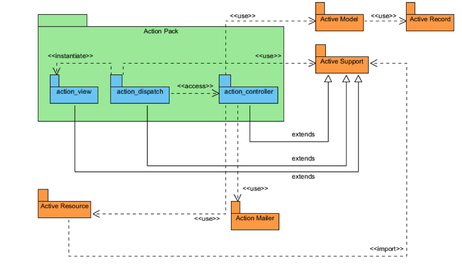

# Trabalho Final Ruby on Rails

## Pergunta 1
1.1 - O que é framework?  
1.2 - Qual seu propósito (desenvolvimento web, mobile, frontend)?   
1.3 - Como ele é estruturado (há diagrama de classes, arquitetural, dentre outros)?   
1.4 - Quais são os pontos de extensão de funcionalidades desse framework (hot-spots)?  
1.5 Qual o modelo de componente definido para o framework? Ele está publicamente definido e acessível?  

### 1.1 O que é FrameWork

  Um framework é um conjunto lógico que tem por objetivo fornecer uma estrutura lógica comum entre projetos, podendo ser utilizado em âmbito organizacional como no caso dos framework de desenvolvimento ou em escopo de código.

  O framework em estudo neste trabalho está dentro do escopo de código, os framework de código possuem a característica de serem um conjunto de classes com lógicas genéricas reutilizáveis, que tem como objetivo reduzir trabalho e repetição de código em um projeto.

  Para que ocorra a reutilização de código os frameworks possuem pontos de extensão para suas funcionalidades estes podendo ser divididos entre hotspots e frozen spots, onde os hot spots são pontos de extensão permissivos onde adaptações no código podem ser realizadas, geralmente por herança, e os frozen spots são pontos onde não há a possibilidade de alteração da lógica imposta pelo framework.

  ## 1.2. Ruby on Rails

  ### 1.2 Propósito

  O framework ruby on rails e voltado para o desenvolvimento de aplicações web na linguagem ruby, prestando auxílio em quesitos comuns em aplicações web como requisições, protocolos HTTP, armazenamento em banco de dados entre outros.

  Para realizar essas funções o ruby on rails tenta engessar o desenvolvimento ao padrão arquitetural model-views-controller prestando pontos de extensão para cada camada do modelo arquitetural.

  ### 1.3 Estrutura

  #### 1.3.1 Módulos

  ***Action Mailer***

  Esse módulo é responsável por prover o serviço de e mail, os componentes contidos neste módulo podem ser utilizados através de hotspots, onde há a herança de classes abstratas.

  ***Action Pack***

  O módulo das  Action Pack prover ao rails 3 sub-módulos:

  * Action Dispatch

  É um módulo que possui a função de transmitir as informações das requisições, geralmente esse módulo é utilizado pelo próprio framework,
  porém pode ser utilizado pelo usuário do framework se necessário.

  * Action Controller

  É o módulo que realiza o controle do fluxo de negócio, fazendo a comunicação e o processamento entre a view e a model,as classes contidas neste módulo geralmente são utilizadas com pontos hotspots.

  * Action View

  É chamada pela Action Controller e tem a função de apresentar a páginas requisitadas.

  ***Active Model***

  Define um modo de acesso entre a controller e a active Record.

  ***Active Record***

  Esse módulo é responsável pelo mapeamento objeto relacional das classes, é acessada através de hotspots, onde é feito o mapeamento das classes filha no banco de dados.

### 1.4 Principais Pontos de Extensão
Os principais pontos de extensão do Rails são os arquivos das Models e os arquivo das Controllers:

ActionController e ApplicationRecord.

**ActionController** é um módulo (module), ou seja, uma coleção de métodos e constantes que dão vida as controllers do Rails. Esse módulo é estendido em todas as controllers de um projeto em Rails, assim o desevolvedor tem uma conexão entre lógica de negócio (controller), as ações do banco de dados (através da model) e também entre a demonstração de dados para o cliente através das views. Cada controller possui a implementação das conexões HTTP (definidas nas rotas), desde de o entendimento de diferentes formatos, por exemplo o JSON, como também na interpretação dos parâmentros que são passados em cada requisição. A ActionController consegue lidar com isso tudo ser receber alterações do usuário desenvolvedor. Assim o desenvoldor consegue trabalhar com as controllers do Rails sem se preocupar com toda essa parte genérica de conexões.

**ActiveRecord** é também um módulo do Rails, responsável por representar os dados e a lógica de negocio de cada entidade do banco de dados. As classes do Rails, localizadas na model, estendem do ActiveRecord. É um ponto de extensão incrível do Rails pois permite que o desenvolvedor crie tabelas, regras de negocio para essas tabelas ([as validations](http://guides.rubyonrails.org/active_record_validations.html)) sem escrever nada em linguagem de banco, sql ou qualquer coisa do tipo. É um módulo que automatiza uma importante atividade do desenvolvimento web, porém que mantém flexivel o suficiente para que o desenvolvedor consiga usar nos mais variados cenários. Além disso o ActiveRecord já adiciona em cada classe os métodos de CRUD, além de vários outros métodos que são úteis no desenvolvimento web, como os callbacks de DB por exemplo.

### 1.5 Modelo de Componente definido para o Rails

## Pergunta 2
2.1 - O que é um componente de software para o framework adotado e como ele é estruturado? 
2.2 - Como os detalhes de sua implementação são ocultados dos framework? 
2.3 - Como suas interfaces de comunicação / composição devem ser definidas? 
2.4 - Como componentes de software são adaptados para o framework sob investigação? Glue-code? Herança? Adapter? etc...

## Pergunta 3
3.1 - Quais são os modos  geralmente utilizados para composição componentes / frameworks? 
3.2 - Como se dá a comunicação entre componentes / framework? 
3.3 - Há um diagrama comportamental (sequencia, colaboração, etc) que demonstre tal comunicação?

### 3 Comunicação entre os Componentes

A comunicação entre os Componentes do Ruby on Rails pode ser observado e analisado a partir de 2 modos de visualização em UML, sendo um deles o Module View, que apresenta todos os componentes do framework de forma estática, e outro chama-se Component & Connector View, que exibe os componentes da forma com que eles existem em tempo de execução e como eles se comunicam entre si.

Imagem 1 - Module View

Imagem 2 - Component & Connector View
